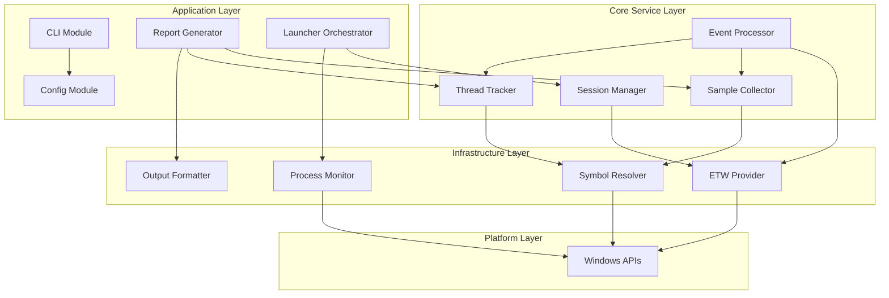

# ETW Windows性能分析工具 - 软件架构设计

## 1. 概述

本文档描述了一个基于ETW (Event Trace for Windows) 的Windows性能分析工具的完整软件架构设计。

### 1.1 设计目标
- 支持两种检测模式：附加检测(Attach)和启动检测(Launch)
- 自动加载PDB符号文件
- 输出CSV格式的性能统计报告
- 按线程分类统计
- 支持调用堆栈查询

### 1.2 设计原则
- **高内聚低耦合**: 每个模块有明确的单一职责
- **开闭原则**: 易于扩展新功能而不修改现有代码
- **依赖倒置**: 依赖抽象而非具体实现

---

## 2. 模块架构

### 2.1 模块层级图

```
┌─────────────────────────────────────────────────────────────────────────────┐
│                           Application Layer                                  │
│  ┌──────────────┐  ┌──────────────┐  ┌──────────────┐  ┌──────────────────┐ │
│  │    CLI       │  │   Config     │  │   Report     │  │   Launcher       │ │
│  │   Module     │  │   Module     │  │   Generator  │  │   Orchestrator   │ │
│  └──────┬───────┘  └──────┬───────┘  └──────┬───────┘  └────────┬─────────┘ │
└─────────┼─────────────────┼─────────────────┼───────────────────┼───────────┘
          │                 │                 │                   │
          └─────────────────┴─────────────────┴───────────────────┘
                                    │
┌───────────────────────────────────┼─────────────────────────────────────────┐
│                                   ▼                                         │
│                          Core Service Layer                                 │
│  ┌─────────────────────────────────────────────────────────────────────┐   │
│  │                        Profiler Engine                               │   │
│  │  ┌─────────────┐  ┌─────────────┐  ┌─────────────┐  ┌────────────┐ │   │
│  │  │  Session    │  │   Event     │  │   Sample    │  │  Thread    │ │   │
│  │  │  Manager    │  │  Processor  │  │  Collector  │  │  Tracker   │ │   │
│  │  └─────────────┘  └─────────────┘  └─────────────┘  └────────────┘ │   │
│  └─────────────────────────────────────────────────────────────────────┘   │
└─────────────────────────────────────────────────────────────────────────────┘
          │                 │                 │                   │
          ▼                 ▼                 ▼                   ▼
┌─────────────────────────────────────────────────────────────────────────────┐
│                          Infrastructure Layer                                │
│  ┌──────────────┐  ┌──────────────┐  ┌──────────────┐  ┌──────────────────┐ │
│  │     ETW      │  │   Symbol     │  │   Process    │  │    Output        │ │
│  │   Provider   │  │   Resolver   │  │   Monitor    │  │   Formatter      │ │
│  └──────────────┘  └──────────────┘  └──────────────┘  └──────────────────┘ │
└─────────────────────────────────────────────────────────────────────────────┘
          │                 │                 │                   │
          ▼                 ▼                 ▼                   ▼
┌─────────────────────────────────────────────────────────────────────────────┐
│                          Platform Abstraction Layer                          │
│  ┌─────────────────────────────────────────────────────────────────────┐    │
│  │              Windows ETW API / DbgHelp API / Win32 API              │    │
│  └─────────────────────────────────────────────────────────────────────┘    │
└─────────────────────────────────────────────────────────────────────────────┘
```

### 2.2 模块职责说明

| 模块 | 层级 | 职责 |
|------|------|------|
| CLI Module | Application | 命令行参数解析、用户交互 |
| Config Module | Application | 配置管理、配置文件解析 |
| Report Generator | Application | 生成CSV报告、格式化输出 |
| Launcher Orchestrator | Application | 协调启动/附加流程、生命周期管理 |
| Session Manager | Core | ETW会话生命周期管理、缓冲区控制 |
| Event Processor | Core | 事件过滤、事件分发、回调处理 |
| Sample Collector | Core | 采样点收集、时间戳记录 |
| Thread Tracker | Core | 线程状态管理、线程分类统计 |
| ETW Provider | Infrastructure | 原始ETW API封装、事件订阅 |
| Symbol Resolver | Infrastructure | PDB加载、符号解析、源码映射 |
| Process Monitor | Infrastructure | 进程创建监控、DLL加载追踪 |
| Output Formatter | Infrastructure | 输出格式化、文件写入 |

---

## 3. 模块依赖关系



### 3.1 依赖原则

1. **单向依赖**: 上层依赖下层，禁止反向依赖
2. **接口隔离**: 核心层通过trait与基础设施层交互
3. **依赖注入**: 具体实现通过构造函数注入

---

## 4. 核心数据结构与Trait

### 4.1 核心数据结构定义

```rust
// ==================== 采样数据类型 ====================

/// 单个采样点，记录某一时刻的调用栈信息
pub struct Sample {
    /// 采样时间戳（高精度计数器）
    pub timestamp: u64,
    /// 目标进程ID
    pub process_id: u32,
    /// 目标线程ID
    pub thread_id: u32,
    /// CPU核心编号
    pub cpu_core: u16,
    /// 调用栈信息
    pub stack_trace: StackTrace,
    /// 线程执行状态
    pub thread_state: ThreadState,
}

/// 线程状态枚举
pub enum ThreadState {
    Running,
    Ready,
    Waiting { reason: WaitReason },
    Suspended,
    Terminated,
}

/// 等待原因
pub enum WaitReason {
    UserRequest,
    IoCompletion,
    Kernel,
    Executive,
    FreePage,
    // ... 其他等待原因
}

/// 调用栈信息
pub struct StackTrace {
    /// 栈帧列表，从顶部（最近调用）到底部
    pub frames: Vec<StackFrame>,
    /// 栈深度
    pub depth: usize,
}

/// 单个栈帧信息
pub struct StackFrame {
    /// 指令指针（地址）
    pub instruction_pointer: u64,
    /// 解析后的符号信息
    pub symbol: Option<SymbolInfo>,
    /// 模块（DLL/EXE）信息
    pub module: Option<ModuleInfo>,
}

// ==================== 符号与模块信息 ====================

/// 符号信息
pub struct SymbolInfo {
    /// 函数名称
    pub name: String,
    /// 函数地址
    pub address: u64,
    /// 函数大小
    pub size: u64,
    /// 源文件路径
    pub source_file: Option<String>,
    /// 源文件行号
    pub line_number: Option<u32>,
    /// 所属模块
    pub module_name: String,
}

/// 模块信息
pub struct ModuleInfo {
    /// 模块名称
    pub name: String,
    /// 基地址
    pub base_address: u64,
    /// 模块大小
    pub size: u64,
    /// 模块路径
    pub path: PathBuf,
    /// PDB文件路径
    pub pdb_path: Option<PathBuf>,
    /// 是否已加载符号
    pub symbols_loaded: bool,
}

// ==================== 线程统计信息 ====================

/// 线程统计汇总
pub struct ThreadStatistics {
    /// 线程ID
    pub thread_id: u32,
    /// 线程名称
    pub name: Option<String>,
    /// 总采样次数
    pub total_samples: u64,
    /// 各状态采样计数
    pub state_counts: HashMap<ThreadState, u64>,
    /// CPU使用时间（纳秒）
    pub cpu_time_ns: u64,
    /// 函数耗时统计
    pub function_stats: Vec<FunctionStats>,
}

/// 单个函数统计
pub struct FunctionStats {
    /// 函数符号信息
    pub symbol: SymbolInfo,
    /// 采样命中次数
    pub hit_count: u64,
    /// 总自耗时（仅当前函数执行时间）
    pub self_time_ns: u64,
    /// 总包含耗时（包含子函数调用）
    pub inclusive_time_ns: u64,
    /// 平均调用深度
    pub avg_depth: f64,
}

// ==================== 会话与配置 ====================

/// 分析会话配置
pub struct ProfilingConfig {
    /// 目标进程路径（Launch模式）
    pub target_path: Option<PathBuf>,
    /// 目标进程参数
    pub target_args: Vec<String>,
    /// 目标进程ID（Attach模式）
    pub target_pid: Option<u32>,
    /// 采样间隔（毫秒）
    pub sampling_interval_ms: u32,
    /// PDB搜索路径
    pub symbol_paths: Vec<PathBuf>,
    /// 符号缓存目录
    pub symbol_cache_dir: PathBuf,
    /// 输出文件路径
    pub output_path: PathBuf,
    /// 最大采样数限制
    pub max_samples: Option<u64>,
    /// 会话持续时间限制（秒）
    pub duration_limit_secs: Option<u64>,
}

/// 分析会话状态
pub enum SessionState {
    Idle,
    Initializing,
    Running,
    Paused,
    Stopping,
    Completed,
    Error(String),
}

// ==================== ETW事件包装 ====================

/// ETW原始事件包装
pub struct EtwEvent {
    /// 事件类型
    pub event_type: EtwEventType,
    /// 原始事件数据
    pub raw_data: Vec<u8>,
    /// 时间戳
    pub timestamp: u64,
    /// 进程ID
    pub process_id: u32,
    /// 线程ID
    pub thread_id: u32,
}

/// ETW事件类型
pub enum EtwEventType {
    SampledProfile,
    ThreadStart,
    ThreadStop,
    ProcessStart,
    ProcessStop,
    ImageLoad,
    ImageUnload,
    StackWalk,
    ContextSwitch,
    // ... 其他事件类型
}
```

### 4.2 核心Trait接口定义

```rust
// ==================== 会话管理 Trait ====================

/// 分析会话管理器
pub trait SessionManager: Send + Sync {
    /// 创建新的分析会话
    fn create_session(&mut self, config: ProfilingConfig) -> Result<SessionHandle, SessionError>;
    
    /// 启动会话
    fn start_session(&mut self, handle: SessionHandle) -> Result<(), SessionError>;
    
    /// 暂停会话
    fn pause_session(&mut self, handle: SessionHandle) -> Result<(), SessionError>;
    
    /// 恢复会话
    fn resume_session(&mut self, handle: SessionHandle) -> Result<(), SessionError>;
    
    /// 停止会话
    fn stop_session(&mut self, handle: SessionHandle) -> Result<ProfilingResult, SessionError>;
    
    /// 获取会话状态
    fn get_session_state(&self, handle: SessionHandle) -> SessionState;
    
    /// 获取当前配置
    fn get_config(&self, handle: SessionHandle) -> Option<&ProfilingConfig>;
}

/// 会话句柄（唯一标识）
#[derive(Clone, Copy, Debug, PartialEq, Eq, Hash)]
pub struct SessionHandle(pub u64);

// ==================== 事件处理 Trait ====================

/// 事件处理器
pub trait EventHandler: Send + Sync {
    /// 处理ETW事件
    fn on_event(&mut self, event: &EtwEvent) -> Result<(), EventError>;
    
    /// 处理采样事件
    fn on_sample(&mut self, sample: &Sample) -> Result<(), EventError>;
    
    /// 处理线程创建事件
    fn on_thread_start(&mut self, thread_id: u32, process_id: u32) -> Result<(), EventError>;
    
    /// 处理线程终止事件
    fn on_thread_stop(&mut self, thread_id: u32) -> Result<(), EventError>;
    
    /// 处理模块加载事件
    fn on_module_load(&mut self, module: &ModuleInfo) -> Result<(), EventError>;
}

/// 事件处理器注册表
pub trait EventHandlerRegistry: Send + Sync {
    /// 注册处理器
    fn register(&mut self, handler: Box<dyn EventHandler>) -> HandlerId;
    
    /// 注销处理器
    fn unregister(&mut self, id: HandlerId) -> Option<Box<dyn EventHandler>>;
    
    /// 广播事件到所有处理器
    fn broadcast(&mut self, event: &EtwEvent) -> Result<(), EventError>;
}

/// 处理器ID
#[derive(Clone, Copy, Debug, PartialEq, Eq, Hash)]
pub struct HandlerId(pub u64);

// ==================== 符号解析 Trait ====================

/// 符号解析器接口
pub trait SymbolResolver: Send + Sync {
    /// 初始化符号解析器
    fn initialize(&mut self, search_paths: &[PathBuf], cache_dir: &Path) -> Result<(), SymbolError>;
    
    /// 加载模块的符号信息
    fn load_module_symbols(&mut self, module: &ModuleInfo) -> Result<(), SymbolError>;
    
    /// 解析地址对应的符号
    fn resolve_address(&self, address: u64) -> Option<SymbolInfo>;
    
    /// 解析调用栈中所有地址的符号
    fn resolve_stack(&self, addresses: &[u64]) -> Vec<Option<SymbolInfo>>;
    
    /// 预加载指定进程的模块符号
    fn preload_process_symbols(&mut self, process_id: u32) -> Result<(), SymbolError>;
    
    /// 获取已加载模块列表
    fn get_loaded_modules(&self) -> Vec<&ModuleInfo>;
    
    /// 清理符号缓存
    fn clear_cache(&mut self);
}

// ==================== 数据采集 Trait ====================

/// 采样数据收集器
pub trait SampleCollector: Send + Sync {
    /// 开始收集
    fn start(&mut self) -> Result<(), CollectorError>;
    
    /// 停止收集
    fn stop(&mut self) -> Result<Vec<Sample>, CollectorError>;
    
    /// 添加采样点
    fn add_sample(&mut self, sample: Sample) -> Result<(), CollectorError>;
    
    /// 获取当前采样数量
    fn sample_count(&self) -> u64;
    
    /// 清空所有采样数据
    fn clear(&mut self);
    
    /// 获取指定线程的采样数据
    fn get_thread_samples(&self, thread_id: u32) -> Vec<&Sample>;
}

/// 线程追踪器
pub trait ThreadTracker: Send + Sync {
    /// 注册新线程
    fn register_thread(&mut self, thread_id: u32, name: Option<String>, process_id: u32);
    
    /// 注销线程
    fn unregister_thread(&mut self, thread_id: u32);
    
    /// 更新线程状态
    fn update_thread_state(&mut self, thread_id: u32, state: ThreadState);
    
    /// 获取线程统计信息
    fn get_thread_stats(&self, thread_id: u32) -> Option<&ThreadStatistics>;
    
    /// 获取所有线程统计
    fn get_all_thread_stats(&self) -> Vec<&ThreadStatistics>;
    
    /// 按采样数据更新统计
    fn update_stats_from_sample(&mut self, sample: &Sample);
}

// ==================== 报告生成 Trait ====================

/// 报告生成器
pub trait ReportGenerator: Send + Sync {
    /// 生成报告
    fn generate(&self, data: &ProfilingData) -> Result<Report, ReportError>;
    
    /// 写入文件
    fn write_to_file(&self, report: &Report, path: &Path) -> Result<(), ReportError>;
}

/// 格式化器接口
pub trait Formatter: Send + Sync {
    /// 格式化报告
    fn format(&self, report: &Report) -> Result<String, FormatError>;
    
    /// 获取文件扩展名
    fn file_extension(&self) -> &'static str;
    
    /// 获取MIME类型
    fn mime_type(&self) -> &'static str;
}

/// CSV格式化器
pub trait CsvFormatter: Formatter {
    /// 设置分隔符
    fn set_delimiter(&mut self, delimiter: char);
    
    /// 设置是否包含表头
    fn set_include_headers(&mut self, include: bool);
}

// ==================== ETW提供者 Trait ====================

/// ETW事件提供者
pub trait EtwProvider: Send + Sync {
    /// 启动ETW会话
    fn start_trace(&mut self, session_name: &str, config: &EtwConfig) -> Result<(), EtwError>;
    
    /// 停止ETW会话
    fn stop_trace(&mut self) -> Result<(), EtwError>;
    
    /// 启用事件提供者
    fn enable_provider(&mut self, provider_id: &Guid, level: u8, keywords: u64) -> Result<(), EtwError>;
    
    /// 设置事件回调
    fn set_event_callback(&mut self, callback: Box<dyn Fn(&EtwEvent) -> Result<(), EtwError> + Send>);
    
    /// 处理事件缓冲区
    fn process_events(&mut self, timeout_ms: u32) -> Result<u32, EtwError>;
    
    /// 是否正在运行
    fn is_running(&self) -> bool;
}

/// ETW配置
pub struct EtwConfig {
    pub buffer_size_kb: u32,
    pub min_buffers: u32,
    pub max_buffers: u32,
    pub flush_timeout_secs: u32,
    pub enable_stack_walk: bool,
}

// ==================== 进程监控 Trait ====================

/// 进程监控器
pub trait ProcessMonitor: Send + Sync {
    /// 启动监控
    fn start_monitoring(&mut self, target: ProcessTarget) -> Result<(), MonitorError>;
    
    /// 停止监控
    fn stop_monitoring(&mut self) -> Result<(), MonitorError>;
    
    /// 设置进程创建回调
    fn on_process_created(&mut self, callback: Box<dyn Fn(u32) + Send>);
    
    /// 设置进程终止回调
    fn on_process_terminated(&mut self, callback: Box<dyn Fn(u32) + Send>);
    
    /// 设置模块加载回调
    fn on_module_loaded(&mut self, callback: Box<dyn Fn(&ModuleInfo) + Send>);
    
    /// 等待进程退出（阻塞）
    fn wait_for_exit(&self, timeout_ms: u32) -> Result<u32, MonitorError>;
}

/// 监控目标
pub enum ProcessTarget {
    /// 启动新进程
    Launch { path: PathBuf, args: Vec<String> },
    /// 附加到现有进程
    Attach { pid: u32 },
}

// ==================== 启动器 Trait ====================

/// 分析启动器
pub trait ProfilerLauncher: Send + Sync {
    /// 启动分析（Launch模式）
    fn launch(&mut self, config: &ProfilingConfig) -> Result<ProfilingSession, LaunchError>;
    
    /// 附加到现有进程
    fn attach(&mut self, pid: u32, config: &ProfilingConfig) -> Result<ProfilingSession, LaunchError>;
    
    /// 分离会话
    fn detach(&mut self, session: ProfilingSession) -> Result<(), LaunchError>;
}

/// 分析会话
pub struct ProfilingSession {
    pub handle: SessionHandle,
    pub process_id: u32,
    pub start_time: std::time::Instant,
}

/// 分析结果数据
pub struct ProfilingData {
    pub session_info: ProfilingSession,
    pub samples: Vec<Sample>,
    pub thread_stats: Vec<ThreadStatistics>,
    pub modules: Vec<ModuleInfo>,
    pub duration_ms: u64,
}
```

---

## 5. 模块间通信机制

### 5.1 事件驱动架构

```
┌─────────────────────────────────────────────────────────────────┐
│                        Event Flow                                │
├─────────────────────────────────────────────────────────────────┤
│                                                                  │
│   ETW Provider ──► Event Processor ──► Handler Registry         │
│        │                  │                    │                │
│        │                  ▼                    ▼                │
│        │            ┌──────────┐        ┌──────────┐           │
│        │            │ Filter   │        │ Sample   │           │
│        │            │ Chain    │        │ Collector│           │
│        │            └────┬─────┘        └────┬─────┘           │
│        │                 │                   │                 │
│        │                 ▼                   ▼                 │
│        │            ┌──────────┐        ┌──────────┐           │
│        │            │ Thread   │        │ Symbol   │           │
│        │            │ Tracker  │        │ Resolver │           │
│        │            └────┬─────┘        └────┬─────┘           │
│        │                 │                   │                 │
│        │                 └─────────┬─────────┘                 │
│        │                           ▼                           │
│        │                     ┌──────────┐                      │
│        │                     │ Report   │                      │
│        │                     │ Generator│                      │
│        │                     └──────────┘                      │
│                                                                  │
└─────────────────────────────────────────────────────────────────┘
```

### 5.2 数据流

1. **事件流**: ETW Provider → Event Processor → Event Handler Chain
2. **采样流**: Sampled Profile Event → Stack Walk → Symbol Resolution → Sample Storage
3. **报告流**: Sample Data → Thread Aggregation → Function Aggregation → Formatter → Output

### 5.3 线程模型

```
┌─────────────────────────────────────────────────────────────────┐
│                       Thread Model                               │
├─────────────────────────────────────────────────────────────────┤
│                                                                  │
│  Main Thread                                                     │
│  ┌─────────────────────────────────────────────────────────┐    │
│  │  CLI / Config / Orchestrator                             │    │
│  └─────────────────────────────────────────────────────────┘    │
│                              │                                   │
│                              ▼                                   │
│  ETW Consumer Thread        Event Processing Thread              │
│  ┌──────────────────┐      ┌─────────────────────────────┐      │
│  │ ProcessTrace()   │─────►│ Event Handlers (Pipeline)   │      │
│  │ (Blocking)       │      │ - Filter                    │      │
│  └──────────────────┘      │ - Enrich                    │      │
│                            │ - Route                     │      │
│                            └─────────────────────────────┘      │
│                                          │                       │
│                              ┌───────────┼───────────┐           │
│                              ▼           ▼           ▼           │
│                            Worker Thread Pool (Symbol Resolution) │
│                            ┌─────────────────────────────┐       │
│                            │ SymbolResolver::resolve_stack│      │
│                            └─────────────────────────────┘       │
│                                                                  │
│  Report Generation Thread (On Demand)                            │
│  ┌─────────────────────────────────────────────────────────┐     │
│  │ ReportGenerator::generate()                              │     │
│  └─────────────────────────────────────────────────────────┘     │
│                                                                  │
└─────────────────────────────────────────────────────────────────┘
```

---

## 6. 扩展点设计

### 6.1 扩展接口汇总

| 扩展点 | Trait | 用途 |
|--------|-------|------|
| 输出格式 | `Formatter` | 支持JSON、XML、HTML等格式 |
| 符号解析 | `SymbolResolver` | 支持DWARF、其他符号格式 |
| 事件处理 | `EventHandler` | 自定义事件处理逻辑 |
| 报告生成 | `ReportGenerator` | 自定义报告内容 |
| 数据源 | `EtwProvider` | 支持其他追踪机制 |

### 6.2 输出格式扩展示例

```rust
// 扩展新的JSON格式输出
pub struct JsonFormatter {
    pretty_print: bool,
}

impl Formatter for JsonFormatter {
    fn format(&self, report: &Report) -> Result<String, FormatError> {
        if self.pretty_print {
            serde_json::to_string_pretty(report)
        } else {
            serde_json::to_string(report)
        }
        .map_err(|e| FormatError::Serialization(e.to_string()))
    }
    
    fn file_extension(&self) -> &'static str { "json" }
    fn mime_type(&self) -> &'static str { "application/json" }
}
```

### 6.3 自定义事件处理器示例

```rust
// 扩展自定义分析器（如内存分析）
pub struct MemoryAnalyzer {
    allocations: HashMap<u64, AllocationInfo>,
}

impl EventHandler for MemoryAnalyzer {
    fn on_event(&mut self, event: &EtwEvent) -> Result<(), EventError> {
        match event.event_type {
            EtwEventType::MemoryAlloc => self.track_allocation(event),
            EtwEventType::MemoryFree => self.track_deallocation(event),
            _ => Ok(()),
        }
    }
    // ... 其他方法
}
```

---

## 7. 错误处理策略

### 7.1 错误类型定义

```rust
/// 统一错误类型
pub enum ProfilerError {
    Session(SessionError),
    Symbol(SymbolError),
    Etw(EtwError),
    Io(std::io::Error),
    Config(String),
}

/// 错误转换实现
impl From<SessionError> for ProfilerError { /* ... */ }
impl From<SymbolError> for ProfilerError { /* ... */ }
impl From<EtwError> for ProfilerError { /* ... */ }
```

### 7.2 错误处理层级

- **Infrastructure层**: 原始Windows API错误转换
- **Core层**: 业务逻辑错误封装
- **Application层**: 用户友好的错误消息

---

## 8. 配置管理

### 8.1 配置文件结构（TOML格式示例）

```toml
[session]
sampling_interval_ms = 10
max_samples = 1000000
duration_limit_secs = 300

[symbols]
search_paths = [
    "C:\\Symbols",
    "https://msdl.microsoft.com/download/symbols"
]
cache_dir = "C:\\SymbolCache"

[output]
format = "csv"
path = "profile_report.csv"
include_source_info = true
sort_by = "inclusive_time"

[filtering]
exclude_system_threads = true
min_sample_count = 10
```

---

## 9. 总结

本架构设计实现了：

1. **清晰的层次结构**: 4层架构确保关注点分离
2. **灵活的扩展机制**: 基于Trait的接口设计支持多维度扩展
3. **高效的并发处理**: 多线程模型确保性能
4. **完整的错误处理**: 统一的错误类型和转换机制
5. **可配置的工作流**: 支持多种使用场景（Launch/Attach）

下一阶段的实现应遵循本架构设计，逐步实现各模块的具体功能。
